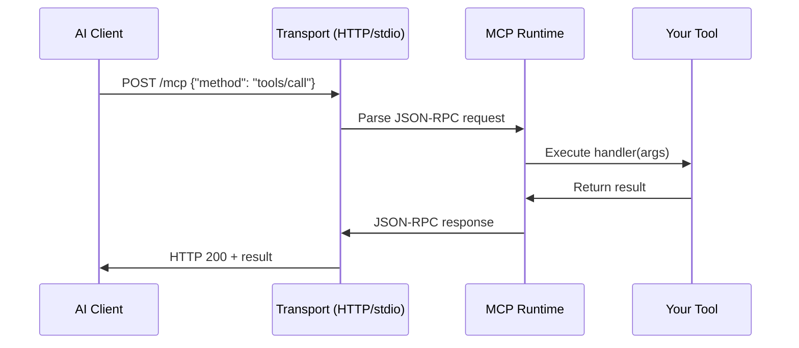

## Overview

xmcp is a framework that compiles your TypeScript/React code into MCP (Model Context Protocol) servers. It consists of three main components:

1. **Compiler** - Discovers and bundles your tools/prompts/resources
2. **Runtime** - Handles MCP protocol communication and request routing
3. **Adapters** - Integrates with existing frameworks (Next.js, Express, NestJS)

## How xmcp Works

### Compilation Process

When you run `xmcp dev` or `xmcp build`, the compiler:

1. **Discovers files** - Scans `src/tools/`, `src/prompts/`, and `src/resources/` directories
2. **Generates import maps** - Creates `.xmcp/import-map.js` with all discovered modules
3. **Builds client bundles** - For React components (`.tsx` files), transpiles them into browser-ready bundles
4. **Bundles server code** - Uses Rspack to bundle everything into `dist/` directory
5. **Generates types** - Creates `xmcp-env.d.ts` for global type definitions

```typescript
// Generated .xmcp/import-map.js (simplified)
export const tools = {
  "greet": () => import("../src/tools/greet.ts"),
  "users_[userId]_profile": () => import("../src/tools/users/[userId]/profile.ts")
};

export const prompts = {
  "review-code": () => import("../src/prompts/review-code.ts")
};
```

### File Watching (Dev Mode)

In development mode, the compiler watches for changes:

- **Tools/Prompts/Resources** - Automatically regenerates import maps and recompiles
- **Middleware** - Detects `src/middleware.ts` and recompiles
- **Config changes** - Reloads `xmcp.config.ts` and rebuilds

From `packages/xmcp/src/compiler/index.ts:61-95`:

```typescript
const watcher = new Watcher({
  persistent: mode === "development",
  ignored: /(^|[\/\\])\../,
  ignoreInitial: false,
});

watcher.watch(`${toolsPath}/**/*.{ts,tsx}`, {
  onAdd: async (path) => {
    toolPaths.add(path);
    if (compilerStarted) {
      await generateCode();
    }
  },
  onUnlink: async (path) => {
    toolPaths.delete(path);
    if (compilerStarted) {
      await generateCode();
    }
  },
});
```

## MCP Protocol Integration

xmcp implements the [Model Context Protocol](https://modelcontextprotocol.io/), which defines how AI applications communicate with context providers (your tools, prompts, and resources).

### Protocol Handlers

The runtime automatically handles MCP protocol methods:

- `tools/list` - Lists all available tools
- `tools/call` - Executes a tool with given arguments
- `prompts/list` - Lists all available prompts
- `prompts/get` - Retrieves a prompt with arguments
- `resources/list` - Lists all available resources
- `resources/read` - Reads resource content

### Request Flow



## Transport Layers

xmcp supports two transport mechanisms:

### HTTP Transport

Stateless HTTP/SSE (Server-Sent Events) for web-based integrations.

```typescript
// packages/xmcp/src/runtime/transports/http/stateless-streamable-http.ts
export class StatelessHttpServerTransport {
  async handleRequest(
    req: IncomingMessage,
    res: ServerResponse,
    bodyContent: any
  ) {
    // Parse JSON-RPC request
    // Route to appropriate handler
    // Send JSON-RPC response
  }
}
```

**Configuration:**

```typescript
// xmcp.config.ts
export default {
  http: {
    port: 3001,
    host: "127.0.0.1",
    endpoint: "/mcp",
    bodySizeLimit: 1024 * 1024 * 10, // 10MB
    cors: {
      origin: "*",
      methods: ["GET", "POST"],
      credentials: false
    }
  }
}
```

### stdio Transport

CLI-based communication using stdin/stdout (used by Claude Desktop, Cursor, etc.).

```typescript
// packages/xmcp/src/runtime/transports/stdio/index.ts
export class StdioTransport {
  constructor(mcpServer: McpServer, debug: boolean = false) {
    this.transport = new StdioServerTransport();
  }

  public start(): void {
    this.mcpServer.connect(this.transport);
    // Reads from stdin, writes to stdout
  }
}
```

**Configuration:**

```typescript
// xmcp.config.ts
export default {
  stdio: {
    debug: false
  }
}
```

## Build vs Dev Modes

### Development Mode (`xmcp dev`)

- **File watching enabled** - Hot reload on changes
- **Source maps** - Full debugging support with `eval-cheap-module-source-map`
- **HTTP server auto-restart** - Restarts server after successful compilation
- **No optimization** - Faster builds

```typescript
// From compiler/index.ts
const bundlerConfig: RspackOptions = {
  mode: "development",
  watch: true,
  devtool: "eval-cheap-module-source-map",
  optimization: {
    minimize: false
  }
};
```

### Production Mode (`xmcp build`)

- **No file watching** - One-time build
- **No source maps** - Smaller bundle size
- **Minification enabled** - Optimized code
- **Telemetry** - Build metrics and error reporting

```typescript
const bundlerConfig: RspackOptions = {
  mode: "production",
  watch: false,
  devtool: false,
  optimization: {
    minimize: true,
    mergeDuplicateChunks: true
  }
};
```

## Framework Adapters

Adapters allow xmcp to integrate with existing frameworks without running a separate HTTP server.

### Next.js Adapter

Integrates as an API route handler:

```typescript
// packages/xmcp/src/runtime/adapters/nextjs/index.ts
export async function xmcpHandler(request: Request): Promise<Response> {
  // Only handle POST requests
  if (request.method !== "POST") {
    return createMethodNotAllowedResponse();
  }

  // Convert Web Request to Node.js IncomingMessage
  const bodyContent = await request.json();
  const incomingRequest = createIncomingMessage({
    method: request.method,
    url: request.url,
    headers: Object.fromEntries(request.headers.entries())
  });

  // Handle request through transport
  await lifecycle.transport.handleRequest(
    incomingRequest,
    res,
    bodyContent
  );
}
```

**Usage:**

```typescript
// xmcp.config.ts
export default {
  http: true,
  experimental: {
    adapter: "nextjs"
  }
}
```

```typescript
// app/api/mcp/route.ts
import { xmcpHandler } from "xmcp/adapters/nextjs";

export const POST = xmcpHandler;
```

### Express Adapter

Provides an Express middleware:

```typescript
// packages/xmcp/src/runtime/adapters/express/index.ts
export async function xmcpHandler(req: Request, res: Response) {
  const server = await createServer();
  const transport = new StatelessHttpServerTransport(
    debug,
    bodySizeLimit || "10mb"
  );

  await server.connect(transport);
  await transport.handleRequest(req, res, req.body);
}
```

**Usage:**

```typescript
// xmcp.config.ts
export default {
  experimental: {
    adapter: "express"
  }
}
```

```typescript
// server.ts
import express from "express";
import { xmcpHandler } from "xmcp/adapters/express";

const app = express();
app.use(express.json());
app.post("/mcp", xmcpHandler);
```

### NestJS Adapter

Provides a NestJS controller and service:

```typescript
// xmcp.config.ts
export default {
  experimental: {
    adapter: "nestjs"
  }
}
```

```typescript
// app.module.ts
import { XmcpModule } from "xmcp/adapters/nestjs";

@Module({
  imports: [XmcpModule],
})
export class AppModule {}
```

## Bundler Configuration

xmcp uses [Rspack](https://rspack.dev/) as its bundler, configured in `packages/xmcp/src/compiler/get-bundler-config/index.ts`.

### Key Configuration

- **Target**: `node` (or `webworker` for Cloudflare)
- **Module system**: CommonJS (or ES modules for Cloudflare)
- **Externals**: Node.js built-ins and `node_modules` dependencies
- **Loaders**: SWC for TypeScript/TSX transformation

### Custom Bundler Config

You can extend the bundler configuration:

```typescript
// xmcp.config.ts
import { XmcpConfig } from "xmcp";

export default {
  bundler: (config) => {
    // Add custom loader for images
    config.module?.rules?.push({
      test: /\.(png|jpe?g|gif)$/i,
      type: "asset/inline"
    });

    // Add custom alias
    config.resolve = {
      ...config.resolve,
      alias: {
        ...config.resolve?.alias,
        "@utils": "./src/utils"
      }
    };

    return config;
  }
} satisfies XmcpConfig;
```

## Type Generation

xmcp generates TypeScript definitions for global access to your tools:

```typescript
// Generated xmcp-env.d.ts
declare global {
  namespace XMCP {
    interface Tools {
      greet: ToolRegistryItem;
      "users_[userId]_profile": ToolRegistryItem;
    }
  }
}
```

This enables type-safe access in adapters:

```typescript
import { tools } from ".xmcp/tools";

// TypeScript knows all available tools
const greetTool = tools.greet;
await greetTool.execute({ name: "Alice" });
```

## Platform Support

xmcp can be deployed to multiple platforms:

- **Node.js** - Standalone server or framework adapter
- **Vercel** - Serverless functions (stdio disabled automatically)
- **Cloudflare Workers** - Edge runtime with ES modules output
- **Docker** - Standard containerization

<Note>
  Platform detection happens automatically. For example, Vercel and Cloudflare builds disable stdio transport and ensure HTTP is enabled.
</Note>
